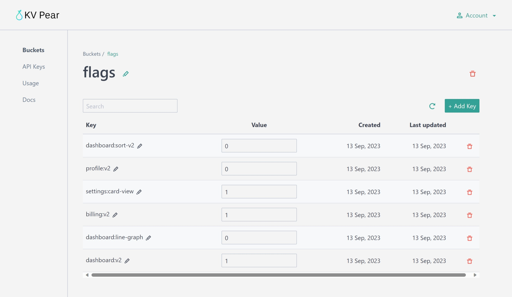
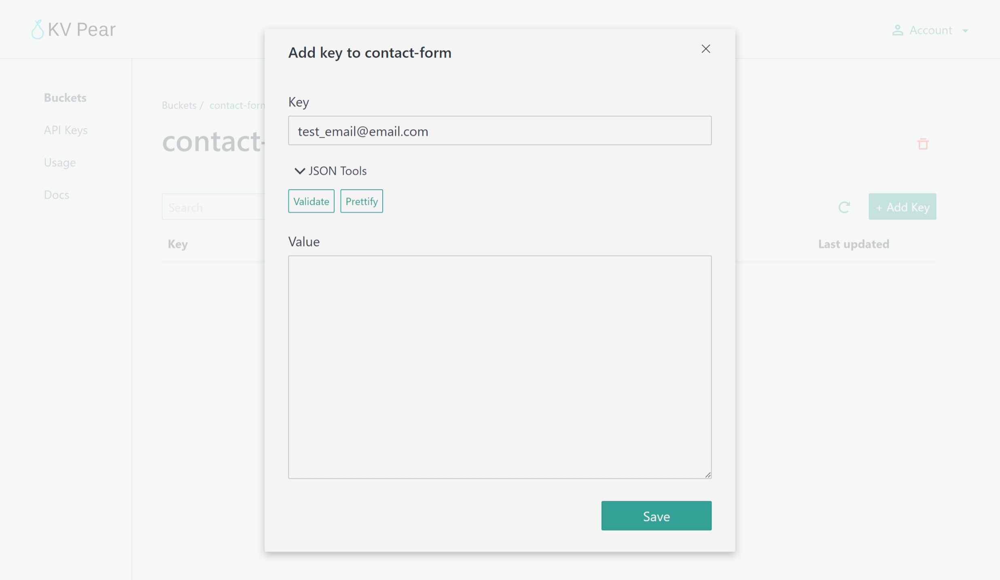

# KV Pear
Headless key-value storage application.

## KV storage as an API
KV Pear provides a UI interface and a headless API for storing and retrieving key-value pairs. The API has an intuitive interface for easily creating and retrieving key-value pairs. The API uses API keys for authentication that can be created using the dashboard. Billing is based on usage and can be configured using Stripe.

## Frontend application
The frontend application allows you to create API keys, buckets and key-pairs. You can create, edit and delete key-pairs and the interface includes some useful JSON tools to make working with JSON values easier. The dashboard uses magic email link login for authentication.

## Use cases
- Feature flagging
- Simple frontend value tracking (website visits, button clicks)
- Storing JSON configurations (e.g. for using within CI pipelines that can be changed without new deployments)
- Storing form submissions

## Screenshots:

**Bucket view**

**Viewing an item**

**API usage example**

